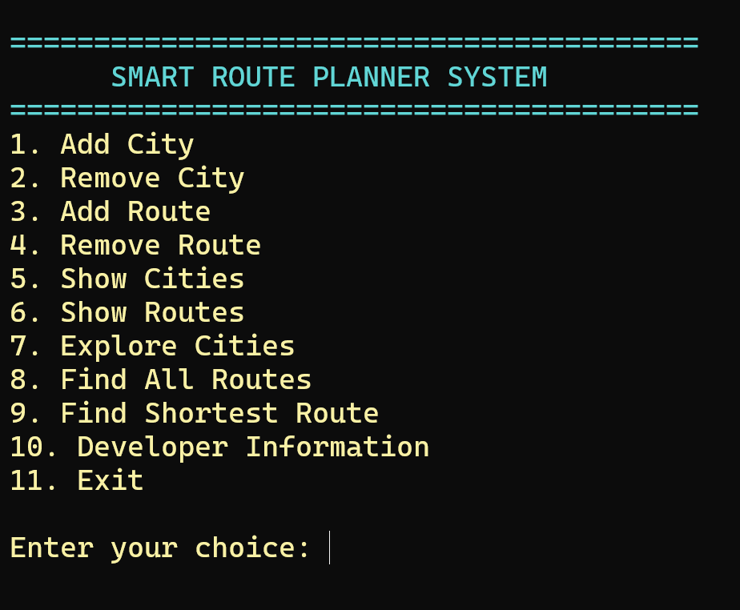

# 🛣️ Smart Route Planner (C++)

A console-based Smart Route Planner built using **Object-Oriented Programming (OOP)** and **Graph Data Structures** in C++.

---

## 📌 Features

- ✅ Add City
- ✅ Remove City
- ✅ Show Cities
- ✅ Add Route
- ✅ Remove Route
- ✅ Show Routes
- ✅ City Validation
- ✅ Distance Validation
- ✅ Duplicate Road Detection
- ✅ Explore Cities (DFS Traversal)
- ✅ Find All Possible Routes (Backtracking)
- ✅ Find Shortest Route (Dijkstra's Algorithm)
- ✅ CSV File Storage (Persistent Data)
- ✅ Case-Insensitive City Search
- ✅ Developer Information

---

## 🧠 Algorithms Used

- Depth First Search (DFS)
- Backtracking
- Dijkstra's Shortest Path Algorithm

---

## 📂 Data Structure

- Undirected Graph
- Adjacency List
- Vector
- Pair
- Priority Queue

---

## 💾 File Handling

Project data is automatically saved using CSV files.

- `cities.csv`
- `routes.csv`

Cities and routes remain available even after restarting the program.

---

## 🛠️ Technologies Used

- C++
- Object-Oriented Programming (OOP)
- Standard Template Library (STL)
- Vector
- Queue
- Priority Queue
- File Handling (fstream)
- StringStream
- Graph (Adjacency List)

---

## 📸 Project Modules

1. Add City
2. Remove City
3. Add Route
4. Remove Route
5. Show Cities
6. Show Routes
7. Explore Cities (DFS)
8. Find All Routes
9. Find Shortest Route
10. Developer Information

---

## 📸 Project Preview

---

## 🚀 Future Improvements

- GUI Version
- Map Visualization
- Real GPS Integration
- Traffic-Based Route Recommendation
- Multiple Transport Modes
- A* Search Algorithm

---

## 👨‍💻 Team

**Project Name:** Smart Route Planner

**Team:** RouteMasters

- Md Rahat Mahamud
- Asem Ibne Zahir
- MD Shahriar Alam Ohe
- Md Ashak Billah Tanzim
- Md Adip Hasan

---

## 📜 License

This project was developed for academic purposes as a **Algorithms Lab Project**.